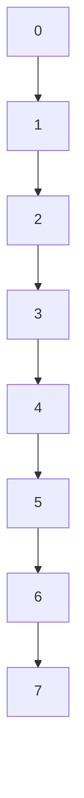
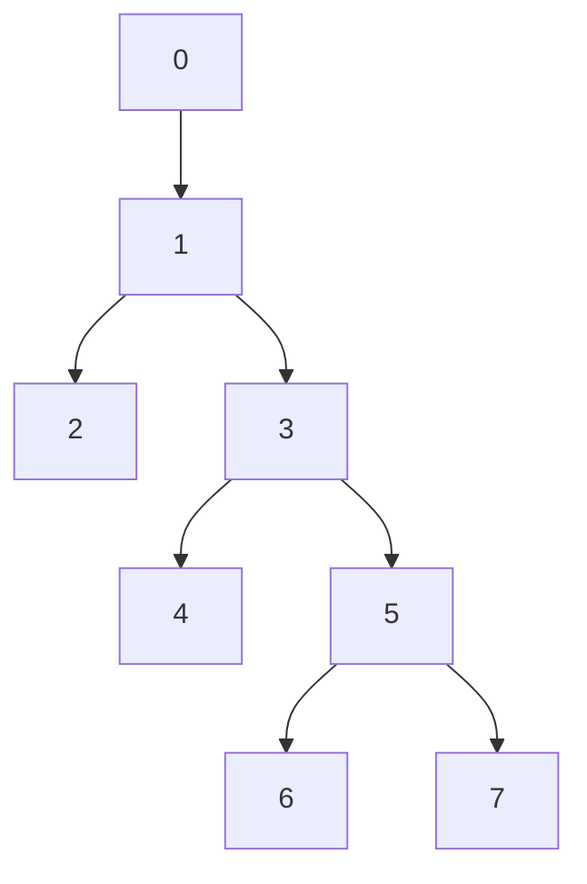

# Examples

## [Program 1.1](./Examples/UnionFind_1_1.c)

### QuickFind Solution to the Connectivity Problem

Reads in a sequence of pairs of non-negative integers less than N from standard input. Input is structured as `p q` to mean connect `p` to `q`. If `p q` are not yet connected then they are reprinted
out.

Uses an array `id` of size `N` with the property
`id[p] == id[q]` iff `p` and `q` are connected.

This approach allows us to perform `find` operations in constant time, but `unions` require us to iterate over the whole array of size `N`.

For processing `M` `unions` on `N` objects this takes $MN$ operations since we must iterate over the entire array $MN$ times.
## [Program 1.2](./Examples/UnionFind_1_2.c)

### QuickUnion solution to the Connectivity Problem

Replaces the body of the `while` loop in [Program 1.1](#program-11) with code that performs faster
`unions` at the cost of slower `finds`. Each connected component is stored as a tree with `id[p]`
representing the parent of `p`. If `p` is the root of the tree then `id[p] == p`.

To perform the `find` we follow `id[]` up to the root for both `p` and `q` and check if they are the
same. To perform the `union` we set `id[i]` to `j` where `i` is the root of the tree containing `p`
and `j` is the root of the tree containing `q`. 

`Unions` are now constant time, `finds` in the worst case require us to traverse the whole array for
`p` and `q`, but in general are faster.

For processing `M` `finds` on `N` objects the algorithm could take more than $MN/2$ operations since the `union` operation may create a line. But in general this approach is faster than [Program 1.1](#program-11).

## [Program 1.3](./Examples/UnionFind_1_3.c)

### Weighted version of QuickUnion

Modified QuickUnion. An additional array `sz[]` now tracks the size of the subtree rooted at `p`. `find` is still performed the same way, but `unions` are now performed by linking the smaller tree to the larger tree, this prevents the growth
of long paths in the structure.

*Note:* Once a node stops being a root it cannot become one again, so we only need to ensure that `sz[p]` is maintained as long as `p` is a root node.

Trees can longer grow to a depth greater than $\log(N)$ for $N$ objects, so the total cost of processing $M$ edges on $N$ objects becomes $M\log(N)$.

## [Program 1.4](./Examples/UnionFind_1_4.c)
### Path compression by halving

Improves on [Program 1.3](#program-13) by implementing path compression. Here as we perform `find` operations we adjust the parent of each node, to be it's current grandparent. This nearly halves the path length.

Asymptotically this flattens the tree giving near constant runtime. 
# Exercises
## Exercise 1.1

*Give the output that a connectivity algorithm should produce when given the input*
```
0 2
1 4
2 5
3 6
0 4
6 0
1 3
```

**Solution**:
```
0 2 // All nodes isolated
1 4 // 0-2
2 5 // 0-2, 1-4
3 6 // 0-2-5, 1-4
0 4 // 0-2-5, 1-4, 3-6
6 0 // 1-4-0-2-5, 3-6
// 3-6-1-4-0-2-5
```
Observe that only in the last input `1 3` do we have an already implied connection

## Exercise 1.2

*List all the different ways to connect two different objects for the example in Figure 1.1*

**Solution**: Unclear if this is asking after the connectivity problem has run, in which case all the objects are connected or at the start in which case there are $\sum_{N=0}^{8} {^8P_N}$ ways to do so.

(Pick two vertices, then either connect them directly ($N=0$), or pick a permutation of $N$ of the remaining $8$ vertices and use that permutation to connect them) which is too many to list.

## Exercise 1.3

*Describe a simple method for counting the number of sets remaining after using `union` and `find` operations to solve the connnectivity problem as described in the text.*

**Solution**:
- Assuming an `id` array representation, count the number of unique root nodes.
- If we can only use the Connectivity problem as described: Insert the edge `0-M` for `M = 1 to N - 1`, the number of connected components is the number of output pairs + 1.
    - Works since pairs only input if connected components merge, and this will merge all components that are not connected to `0`. (+1 includes the component originally containing `0`)

## [Exercise 1.4](./Exercises/Ex1_4/ex1_4.c)
Shows the contents of the `id` after each `union` operation using [QuickFind](#program-11)
for the input contained in [sample_data.dat](./Exercises/sample_data.dat). Also counts
the number of times the `id` array is accessed. See [ex1_4.dat](./Exercises/Ex1_4/ex1_4.dat)
for output.


## [Exercise 1.5](./Exercises/Ex1_5/ex1_5.c)
Repeats [Exercise 1.4](#exercise-14) but for [QuickUnion](#program-12). 
See [ex1_5.dat](./Exercises/Ex1_6/ex1_5.dat) for output.


## [Exercise 1.6](./Exercises/Ex1_6/ex1_6.dat)
Gives the contents of the `id` array after each `union` for [Weighted QuickUnion](#program-13)
running on the examples for [Figure 1.7](./Exercises/Ex1_6/figure1_6-7.dat) and [Figure 1.8](./Exercises/Ex1_6/figure1_8.dat). See [ex1_6.dat](./Exercises/Ex1_6/ex1_6.dat)
for output.


## [Exercise 1.7](./Exercises/Ex1_7/ex1_7.c)
Repeats [Exercise 1.4](#exercise-14) but for [Weighted QuickUnion](#program-13). 
See [ex1_4.dat](./Exercises/Ex1_7/ex1_7.dat) for output.


## [Exercise 1.8](./Exercises/Ex1_8/ex1_8.c)
Repeats [Exercise 1.4](#exercise-14) but for 
[Weighted QuickUnion with Path Compression by Halving](#program-14). 
See [ex1_8.dat](./Exercises/Ex1_8/ex1_8.dat) for output.

## Exercise 1.9

*Prove an upper bound on the number of machine instructions required to process $M$ connections on $N$ objects using [Program 1.3](#program-13). You may assume, that any C assignment operation always requires less than $c$ instructions.*

**Solution**

For simplicity we will ignore all the setup and I/O, to focus purely on the union find loops. We also assume that each `for` loop can be counted as purely it's number of assignment operations with some $c$ being a sufficiently large constant to bound the loop overhead.

For find operations the loop
`for (i = p; i != id[i]; i = id[i])` consists of
- One loop variable initialisation
- At most `log(N) + 1` checks `i != id[i]` since the distance from any node to the root is at most `log(N)` and we check every node on the path.
- At most `log(N)` updates `i = id[i]` for the same argument above.

This leads to an upper bound of:

$$
\begin{align}
2c\left(log\left(N\right) + 1\right)
\end{align}
$$

per find. We then have to node that for $M$ connections we have
to perform the find on both elements, giving a total of

$$
\begin{align}
4Mc\left(log\left(N\right) + 1\right)
\end{align}
$$

Next we consider the union. We have to perform the check, 
`id[i] == id[j]` $M$ times. But note, that this can only **fail**
`N - 1` times. (Since after `N - 1` unions everything must be in
the same component). This means that the following union can happen at most `min(M, N - 1)` times.

The union itself consists of one comparison `sz[i] < sz[j]` and
then two assignments `id[i] = j; sz[j] += sz[i]`. (Or `i` and `j` swapped if the comparison fails). This means there are `3c` operations in the union.

Thus the total number of operations from the union is

$$
\begin{align}
c\left(3\text{min}\left(M, N - 1\right) + M\right)
\end{align}
$$

The total upper bound is then

$$\begin{align}
c\left(3\text{min}\left(M, N-1\right) + M\left(4log\left(N\right) + 5\right)\right)
\end{align}
$$

Assuming $M$ is less than $N$ lets us simplify this down to

$$\begin{align}
4Mc\left(2 + log\left(N\right)\right)
\end{align}
$$

## Exercise 1.10

*Estimate the minimum amount of time to run [QuickFind](#program-11) to solve a problem with $10^6$ objects and $10^9$ input edges on a computer capable of executing $10^9$ instructions per second. Assume each iteration of the while loop requires at least $10$ instructions*.

**Solution**:
Ignoring the initialisation code, the algorithm takes
- at least $10^2$ instructions per while loop iteration
- at least $N$ instructions per for loop iteration
- performs at least $M$ iterations over the while loop.

$$
\begin{align}
10^2 \times 10^9 \times 10^6 &= 10^{17} \text{instructions} \\
&= 10^8 \text{seconds}
\end{align}
$$

Which is more than $3$ years.

## Exercise 1.11

*Estimate the maximum amount of time to run [Weighted QuickUnion](#program-13) to solve a problem with $10^6$ objects and $10^9$ input edges on a computer capable of executing $10^9$ instructions per second. Assume each iteration of the while loop requires at most $100$ instructions*.

**Solution**:
Ignoring the initialisation code, the algorithm takes

$$
\begin{align}
10^2 \times 10^9 \times 6\lg(10) &= 2\times 10^{12} \text{ instructions} \\
&= 2 \times 10^{3} \text{ seconds}.
\end{align}
$$

Note $2000$ seconds is rougly $33$ minutes.

## Exercise 1.12

*Compute the **average** distance from a node to the root in a worst case tree of $2^n$ nodes built by [Weighted QuickUnion](#program-13).*

**Solution**
Recall the worst case occurs when we link two trees of equal size. So to have a worst case tree of size $2^n$ we must merge two worst-case trees of size $2^{n - 1}$ etc. So we can focus on trees of size $2^M$.

Consider a few cases:

$n = 0$. Tree is just the root. $\bar{d} = 0$. Maximum depth is $0$.

$n = 1$. Tree is one root, and one node at depth $1$. $\bar{d} = \frac{1}{2}\left(0 + 1\right) = \frac{1}{2}$. Maximum depth is $1$.

$n = 2$. Tree is one root, two nodes at depth $1$, and one node at depth $2$. $\bar{d} = \frac{1}{4}\left(0 + 2 \times 1 + 2\right) = 1$. Maximum depth is $2$.

Observe the pattern, at each step, the path length of each node of one of the subtrees consisting of $2^{n - 1}$ elements increases by one. While the other stays the same. This lets us write the average
$\bar{d}_{2^n}$ in terms of the previous $\bar{d}_{2^{n-1}}$ as

$$
\begin{align}
\bar{d}_{2^n} & = \frac{1}{2^n}\left(2^{n}\bar{d}_{2^{n-1}} + 2^{n-1}\right)
\end{align}
$$

Where the first term is the sum of the path lengths of two worst case subtrees of size $2^{n-1}$ and the second term accounts for the path lengths of nodes in the second subtree increasing by $1$. This simplifies to

$$
\begin{align}
\bar{d}_{2^n} & = \bar{d}_{2^{n-1}} + \frac{1}{2}.
\end{align}
$$

Which starting from $\bar{d}_{2^0} = 0$ gives the simple formula

$$
\begin{align}
    \bar{d}_{2^n} & = \frac{n}{2}.
\end{align}
$$

For fun lets check, $n = 3$, by formula $\bar{d} = \frac{3}{2}$. By first principles $\bar{d} = \frac{1}{8}\left(0 + 3 \times 1 + 3 \times 2 + 3\right) = \frac{12}{8} = \frac{3}{2}$. 

## Exercise 1.13

*Illustrate path compression by halving on a chain of length `8`.*

**Solution**

Initial:


Compressed:

## [Exercise 1.14](./Exercises/Ex1_14/ex1_14.dat)

Gives a sequence of input pairs that causes the [Weighted QuickUnion](#program-13)
to produce a path of length $4$. Use [Exercise 1.7](./Exercises/Ex1_7/ex1_7.c) to validate.
(This will need to be compiled with `N >= 16`)

We simply Extend Figure 1.8 (where the path from 7->0 has length 3) to the next power of two
($2^4 = 16$) and copy the pattern to generate a path length of 4 in this case.

## [Exercise 1.15](./Exercises/Ex1_15/ex1_15.dat)

Give a sequence of input pairs that causes the Weighted Quick Union algorithim to produce
a path of length $4$.

**Solution:** Path compression only occurs when we perform a `find` on a non-root node. In
the solution for exercise 1.14 we only ever input edges between root nodes. Hence no `finds` are performed on non-root nodes and no path compression occurs. Since we know for [Weighted QuickUnion](./Examples/UnionFind_1_3.c) the input for [exercise 1.14](./Exercises/Ex1_14/ex1_14.dat) leads to a path length of 4 the same input also holds in the case of path compression. See [ex1_15.dat](./Exercises/Ex1_15/ex1_15.dat) to validate.

## [Exercise 1.16](./Exercises/Ex1_16-17/ex1_16.c)

Modification of [Program 1.3](#program-13) to implement full path compression, where we
complete each `union` operation by making every node that we touch point to the root of
the new tree.

## [Exercise 1.17](./Exercises/Ex1_16-17/ex1_17.dat)
Repeats [Exercise 1.4](#exercise-14) but for [Weighted Quick Union with full compression](#exercise-116). 
See [ex1_17.dat](./Exercises/Ex1_16-17/ex1_17.dat) for output.

## [Exercise 1.18](./Exercises/Ex1_18/ex1_18.dat)

Give a sequence of input pairs that causes the Weighted QuickUnion algorithm with full path
compression ([Exercise 1.16](#exercise-116)) to produce a path of length $4$.

**Solution**: Observe that our same observation for path compression with halving holds. There is no
compression when we perform a `find` and `union` of two root nodes. This means that the input for [exercise 1.14](./Exercises/Ex1_14/ex1_14.dat)
also leads to a path length of 4. See [ex1_18.dat](./Exercises/Ex1_18/ex1_18.dat) to validate.

## [Exercise 1.19](./Exercises/Ex1_19/ex1_19.dat)

Demonstrate that modifying [QuickUnion](#program-12) to implement [full path compression](#exercise-116)
is not sufficient to ensure that trees have no long paths.

See the implementation in [ex1_16.c](./Exercises/Ex1_16-17/ex1_16.c). A path of length $N - 1$ on $N$ input
objects and $N - 1$ input edges can be generated by the pattern $(N-2, N-1), (N-3, N-2) ...$, where we
assume the items objects are indexed $0...N-1$. See [ex1_19.in](./Exercises/Ex1_19/ex1_19.in) for a
sample input and [ex1_19.dat](./Exercises/Ex1_19/ex1_19.dat) for the corresponding output with $N = 10$.

## [Exercise 1.20](./Exercises/Ex1_20/ex1_20.c)

Modify [Program 1.3](#program-13) to use the *height* of the trees (longest path from any node to the
root), instead of the weight, to decide wether to set `id[i] = j` or `id[j] = i`. Run emprical studies
to compare this variant with [Program 1.3](#program-13).

We use a [Shell Script](./Exercises/Ex1_20/TimingStudies/testRuntime.sh) to time the program, (this has
some inefficiencies due to timing factors other than just the inner loop, such as debugging I/O.) Our
results when taking the average over $50$ runs on
randomly generated inputs, involving $5000$ randomly generated pairs containing numbers from $0-9999$
shows that the average difference is around $30$ milliseconds, with the tree implementation being slightly
better. This is not a huge difference however and we do not measure the std deviation.

## Exercise 1.21

*Prove for the [Weighted Quick Union using height](#exercise-120) that the property below holds*

*The weighted quick-union algorithm follows at most $2lgN$ pointers to determine whether two of $N$ objects are connected*.

**Solution**

**Lemma 1**
The number of pointers followed in a tree of height $h$ is at most $h$. (Trivially true).

**Lemma 2**
A tree built by Exercise 1.20 is always of height $h \leq lgN$ where $N$ is the number of nodes in the tree.

**Proof**
*Base case:* a single node forms a tree of height $0$. $0 \leq lg(1) = 0$, so trivially true.

*Inductive case:* Consider the merging of two trees of height $h_i$ and $h_j$ with $i$ and $j$ nodes respectively each satisfying, $h \leq lg(N)$.

W.l.o.g $i \leq j$. The height of $j$ is now either the height $h_i$ + 1 or the height $h_j$ (if it already contains a subtree of height $(h_j - 1) \geq h_i$). In the later case the inequality is trivially satisfied. In the former case we then have,

$$
\begin{align}
h_i + 1 \leq 1 + lg(i) = lg(2i) \leq lg(i + j).
\end{align}
$$

and as the size of the new tree is $i + j$ the inequality is satisfed.

The proof of the combined statement then follows trivially from **Lemma 1** and **Lemma 2**.

## [Exercise 1.22](./Exercises/Ex1_22/ex1_22.c)

Modification of [Program 1.4](#program-14) to generate random pairs rather than through standard input.
Then for the test cases $N = 10^3, 10^4, 10^5, 10^6$ evaluate how many random pairs are generated
before $N-1$ `unions` are performed. (i.e. the set is fully connected.)

See [ex1_22.dat](./Exercises/Ex1_22/ex1_22.dat) for the results.

## [Exercise 1.23](./Exercises/Ex1_23/ex1_23.c)

Modification of [Exercise 1.22](#exercise-122) to print out the number of edges generated to connect
$N$ items for $100 \leq N \leq 1000$. See [ex1_23.dat](./Exercises/Ex1_23/ex1_23.dat) for results.

## Exercise 1.24

Give an approximate formula for the number of random eges that are required to connect $N$ objects, as a function of $N$.

**Solution**:
Consider a graph $G$, with $N$ vertices, and $M$
edges. The total number of such graphs $G$ is

$$
\begin{align}
  G(N, M) & = ^{^NC_2}C_M
\end{align}
$$

The probability of being fully connected is

$$
\begin{align}
    P(N, M) & = \frac{C(N, M)}{G(N, M)}
\end{align}
$$

where $C(N,M)$ is the number of fully connected graphs containing $N$ vertices and $M$ edges.

Unfortunately this is a hard number to compute. The paper [On Random Graphs (I)](https://snap.stanford.edu/class/cs224w-readings/erdos59random.pdf) gives the formula 

$$
E(n) \approx \frac{1}{2}n\log(n).
$$

derived through random graph theory.

## Exercise 1.25

*Consider a Computer A, and a Computer B that is 10 faster than Computer A. If we run [Weighted QuickUnion](#program-13) on both computers, but give Computer B 10 times as many connections to process, how much longer would it take computer B to finish than computer A?*

**Solution**
Weighted QuickUnion requires $CM\lg(N)$ instructions where $C$ is a fixed constant, $M$ is the number of connections, and $N$ is the number of edges. We can convert this to a rate by introducing the constant $\bar{C}$ which is $C$ divided by the speed of the computer. Then the ratio of time between $B$ and $A$ is

$$
\begin{align}
\frac{B}{A} & = \frac{\bar{C}_BM_B\lg(N)}{\bar{C}_AM_A\lg(N)} \\
&= \frac{10}{10} = 1.
\end{align}
$$

In other words $B$ will take just as long as $A$.

## Exercise 1.26

*Repeat the same analysis as [Exercise 1.25](#exercise-125) for an algorithm that requires $N^3$ instructions.*

**Solution**:

$$
\begin{align}
\frac{B}{A} & = \frac{1}{10}\left(\frac{\left(10N_A\right)^3}{N_A^3}\right) \\
& = \frac{10^3}{10} = 100.
\end{align}
$$

So B will take $100$ times longer than $A$.
