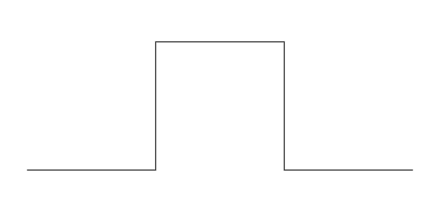

# Pushdown Stack ADT

## Examples

### [Program 4.1](./Examples/Program4_1/stack.h)

#### Basic Stack ADT Interface


*This interface defines the basic operations that
define a pushdown stack. We assume that the four declarations
here are in a file stack.h (see this one), which is referenced
as an include by client programs that use these functions and
implementations that define Item, perhaps by including an Item.h
file. The argument to STACKInit specifies the maximum number of items expected on the stack.* 

### [Program 4.2](./Examples/Program4_2/postfix_eval.c)

#### Postfix expression evaluation

*Pushdown stack client reads any postfix expression
limited to multiplication or addition of integers, then
evaluates the expression and prints the computed result.* 
 * *When we encounter operands, we push them on the stack.*
 * *When we encounter operators we pop the top two entries from the stack and push the result of applying the operator to them.*

*This code features some changes over the basic sedgewick implementation. First we provide more error checking of the input, and second we introduce an intermediate extraction layer through `Token.h`.*

*A `token` represents an individual semantic term in an expression, in our case either an operator or an operand, and we use this to parse the string. The token approach makes it easy to extend to the exercises by seperately modifying how tokens are extracted, and how the program then evaluates specific tokens.*

*This specific tokeniser differentiates between `operators` and `Numbers`. We use an `Item.h` interface to allow us to easily change the underlying number type*.

**Note**: This version works for positive integers with `+` and `*`.

### [Program 4.3](./Examples/Program4_3/infixToPostfix.c)

#### Infix expression to Postfix expression conversion

*This program uses a stack to convert infix expressions to postfix expressions. To convert (A + B) to the postfix A B +, we ignore the left parenthesis, convert A to postfix, save them on the stack convert B to postfix, then, on encountering the right parenthesis, pop the stack and output the + Like with the previous program we provide some modifications for usability, including a `token.h`. This `token.h` differs slightly in that it differentiates between operators, brackets and operands as strings*

### [Program 4.4](./Examples/Program4_4/stackArray.c)

#### Array-based Stack Implementation

*When there are `N` items in the stack this implementation keeps then in `s[0] ... s[N-1];` in order from least recently inserted to most recently inserted. The top of the stack (the position where the next item to be pushed will go) is `s[N]`. The client program passes the maximum number of items expected on the stack as the argument to `STACKInit`, which allocates an array of that size, but this code does not check for errors such as pushing onto a full stack (or popping an empty one).*

### [Program 4.5](./Examples/Program4_5/stackList.c)

#### Linked List-based Stack Implementation

 *This code implements the stack ADT using a linkedList. An auxiliary function NEW is used to allocate the memory for a node, set its fields and return a link to the node.*

## Exercises

### Exercise 4.6

*Taking a letter to mean **push** and an asterisk to mean *pop* give the sequence of values returned by the input sequence:*

```
EAS*Y*QUE***ST***IO*N***
```

**Answer:**
```
SYEUQTSAONIE
```

### Exercise 4.7

*Using the conventions of [Exercise 4.6](#exercise-46), give a way to insert asterisks in the sequence `EASY` so that the
sequence of values returned by the `pop`operations is the given
sequence, else prove that no such modification exists.*

1. `EASY`
```
E*A*S*Y*
```
2. `YSAE`
```
EASY****
```
3. `ASYE`
```
EA*S*Y**
```
4. `AYES`
No such sequence exists, `Y` is pushed onto the stack before `S`, which is pushed on before `E`. If we `pop` `Y` before `E`
then `S` must also be on the stack and must precede `E` so we
cannot then pop `E` before `S`.

### [Exercise 4.8](./Exercise/Ex4_8/ex4_8.c)

*Given two sequences, give an algorithm for determining whether
or not asterisks can be added to make the first produce the second, when interpreted as a sequence of sstack operations in the sense of [Exercise 4.7](#exercise-47).*

This basic idea is as follows, we simulate the action of the stack. We read in elements of `seq1` and push them onto a stack. If after adding a new element to the top of the stack, it is equal to the next element of `seq2` we pop it off and continue until the top of the stack no longer is equal to the next element of `seq2`.

Since the length of the sequences are equal, if after we have pushed everything onto the stack, the stack is not empty then we cannot convert `seq1` into `seq2`. (We found an element of `seq2` we couldn't `pop` from `seq1`.)

**Note:** This implementation may not work with duplicate sequence elements. 

**Note:** Our approach overwrites `seq1` as to use the memory already processed as the stack. This saves memory for computation but does destroy `seq1`.

### [Exercise 4.9](./Exercise/Ex4_9/)

*Convert to postfix the following expression*
```
(5 * ( (9 * 8) + (7 * (4 + 6))))
```

**Solution:**
```
5 9 8 * 7 4 6 + * + *
```

### Exercise 4.10

*Give the contents of the stack as the following expression is evaluated by [Program 4.2](#program-42):*
```
5 9 * 8 7 4 6 + * 2 1 3 * + * + *
```

**Solution:**
```
i   s
5   5
9   5 9
*   45
8   45 8
7   45 8 7
4   45 8 7 4
6   45 8 7 4 6
+   45 8 7 10
*   45 8 70
2   45 8 70 2
1   45 8 70 2 1
3   45 8 70 2 1 3
*   45 8 70 2 3
+   45 8 70 5
*   45 8 350
+   45 358
*   16110
```

### [Exercise 4.11](./Exercise/Ex4_11/)

*Extend [Program 4.2](#program-42) and [Program 4.3](#program-43) to support the `-` (subtract) and `/` (divide) operations.*

These are relatively straightforward operations, in both cases we add `-` and `/` as valid operator tokens in `token.h`. In the
case of [Program 4.2](#program-42) ([Ex4.11a](./Exercise/Ex4_11/Ex4_11a/ex4_11a.c)) we have to note the non-commutativity and the undefined order of function call
evaluations. This means we have to `pop` the second operand off the stack and store it before we perform the
second `pop` and `push` the result. The `main` function of [Program 4.3](#program-43) ([Ex4.11b](./Exercise/Ex4_11/Ex4_11b/ex4_11b.c)) does not need
to be modified, `token.h` covers it all.

**Note**: This exercise recognises subtraction as a
legitimate operation, but does not recognise negative numbers as valid, as this can be interpreted as the unary operation of negation, (see [Exercise 4.12](#exercise-412)).


### [Exercise 4.12](./Exercise/Ex4_12/)

*Extend your solution to [Exercise 4.11](#exercise-411) to
include the unary operator `-` (negation) and `$` (square root). Also, modify the abstract stack machine in [Program 4.2](#program-42) to use floating-point. For example, given the expression*
```
(-(-1) + $((-1) * (-1) - (4 * (-1)))) / 2
```
*the program should print the value $1.618034$.*

This is a little bit more involved. 

The symbol overload of `-` for both subtraction and negation is difficult so we make the following changes. For postfix ([Ex4_12a](./Exercise/Ex4_12/Ex4_12a/ex4_12a.c)) negation is represented by the symbol `~`. For infix ([Ex4_12b](./Exercise/Ex4_12/Ex4_12b/ex4_12.c)) we assume that if `-` is not preceded by a right bracket or an operand than it must be unary negation. This requires us to modify 
`TOKENfromStr` to store the last extracted token as
a static variable in the function.

To change the stack to be able to use `double` we have to update the typedef and the macros which we copy across from [Exercise 4.1](../AbstractObjects/index.md#exercise-41) for  the [Item.h](./Exercise/Ex4_12/Ex4_12a/Item.h) implementation for Ex4_12a.

**Note:** Exercise 4.12b still requires proper bracketing, i.e. `(-3)` to correctly evaluate an expression. This negative number is parsed as `3 ~`.

The combination of Ex4.12b and Ex4.12a is capable of handling negative floating point integers.

### [Exercise 4.13](./Exercise/Ex4_13/step.ps)

*Write a PostScript program that draws a simple step function*

See [step.ps](./Exercise/Ex4_13/step.ps) which generates the figure below.



### [Exercise 4.15](./Exercise/Ex4_15/)

*Write a program that converts a postfix expression to infix, using a pushdown stack.*

For this implementation we attempt to keep all the functionality built in up to and including [Exercise 4.12](#exercise-412). The strategy is as follows, we consider `operators` like `+` and `~`, and operands as
other expressions like `4` or `(4 + 3)`. We parse the
postfix as follows
1. When we encounter a `term` push it onto the stack. Note all these terms will be of the form `x` for some number x.
2. When we encounter an operator, pop the appropriate number of terms of the stack depending on if the operator is *binary* or *unary*
3. Form the new infix term `([term 1] op [term2])` where `[term 1]` is included for a *binary* operator.
4. Push this new term back onto the stack.
5. Continue until the input postfix expression is fully parsed.
6. The final term left on the stack is the complete infix conversion. Pop and display it.

As usual we use a `token.h` method to assist in parsing.


### [Exercise 4.16](./Exercise/Ex4_16/)

*Combine [Program 4.2](#program-42) and [Program 4.3](#program-43) into a single module that uses two different stack ADTs: a stack of operators and a stack of operands.*

**Note**: We have partially generalised the original exercise to from *a stack of integers* to *a stack of operands*. This is because we will base our implementation off the more complete implementations in [Exercise 4.12](#exercise-412).


